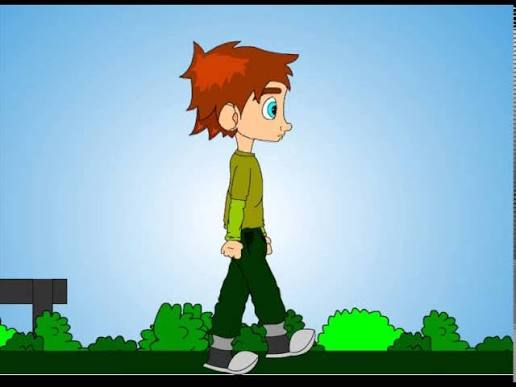
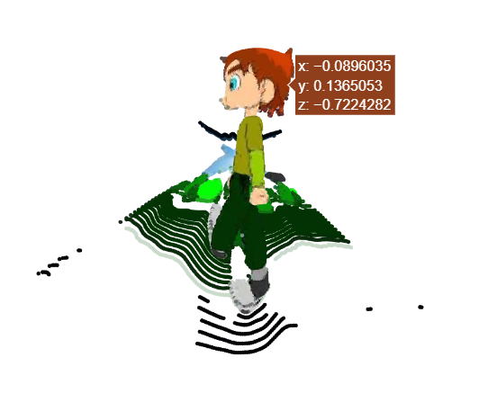
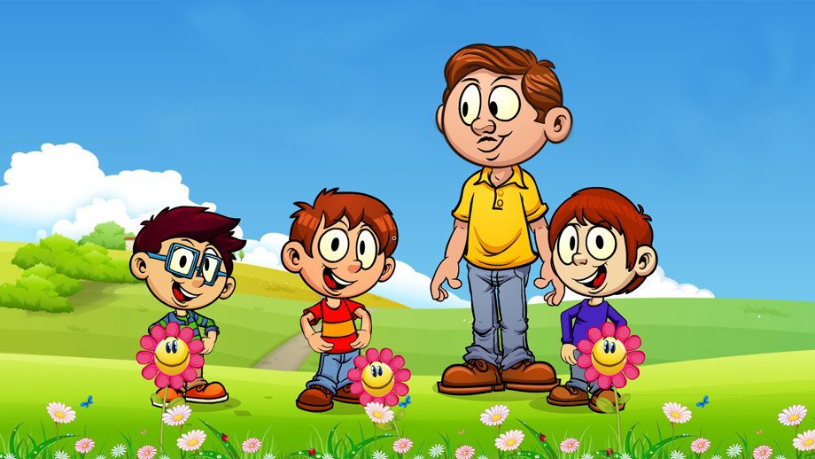
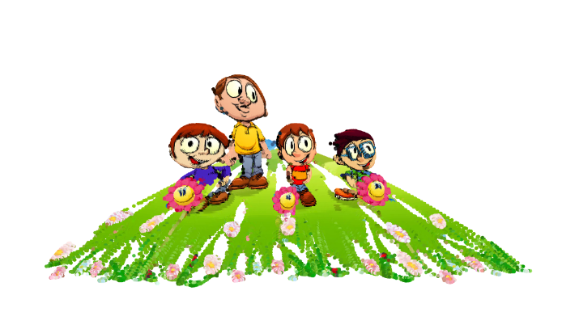

# Zero-Shot Monocular RGB-D Object Reconstruction & Discontinuity Filtering

## 📖 Project Overview
This repository serves as a rapid-validation prototype exploring the intersection of **Vision Foundation Models (VFMs)** and **Classical Geometric Projection**. 

While state-of-the-art labs are heavily focused on complex 3D scene reconstruction (e.g., Neural Radiance Fields, 3D Gaussian Splatting), this pipeline investigates a lightweight, zero-shot alternative: treating a standard monocular 2D camera as a structured RGB-D sensor. By utilizing open-source transformer backbones and executing deterministic inverse pinhole camera projections locally via CUDA, this system extracts, isolates, and projects 2D objects into interactive 3D spatial point clouds.

## 🏗️ Pipeline Architecture
The system operates as a Dual-Backbone Object-Centric Pipeline:

1. **Instance Segmentation (`rembg` / U^2-Net):** The raw 2D image is passed through an alpha-matting network to strip the background, isolating the primary foreground object to prevent background spatial clutter.
2. **Dense Depth Inference (`Depth Anything V2 - Small`):** The isolated RGB image is processed by a local Hugging Face transformer pipeline to estimate relative depth values ($Z$).
3. **Inverse Pinhole Camera Projection:** Using assumed camera intrinsics (focal lengths $f_x, f_y$ and optical centers $c_x, c_y$), the 2D pixel coordinates $(u, v)$ are mapped into physical 3D $(X, Y, Z)$ space.
4. **Edge-Aware Discontinuity Filtering:** A critical spatial gradient filter is applied during projection to mitigate the notorious "Curtain Effect" (occlusion boundary bleeding).

## 🔬 Artifact Analysis: Mitigating the "Curtain Effect"
Monocular depth estimation models smoothly interpolate depth across sharp occlusion boundaries. When directly projected into 3D space, this causes foreground pixels to "bleed" into the background, creating a visual curtain of flying pixels.

To solve this, I implemented an **Edge-Aware Depth Discontinuity Filter**. By calculating the spatial gradient of the depth map, the pipeline actively drops pixels where the local depth jump exceeds a defined threshold (e.g., `0.03`). 

### Visual Evaluation
*(Note: Ensure your 2D and 3D images are uploaded to the repository and replace the filenames below)*

| Original 2D Input | Unfiltered Projection (Curtain Artifact) | Filtered 3D Reconstruction |
| :---: | :---: | :---: |
|  |  |  |
| *Original monocular image* | *Notice the geometric "bleeding" at occlusion edges* | *Sharp, isolated 3D object representation* |

| Original 2D Input | Unfiltered Projection (Curtain Artifact) | Filtered 3D Reconstruction |
| :---: | :---: | :---: |
|  |  |  |
| *Original monocular image* | *Notice the geometric "bleeding" at occlusion edges* | *Sharp, isolated 3D object representation* |

## ⚙️ Installation & Local Execution
This pipeline is optimized to run locally on consumer/mobile workstation GPUs (e.g., NVIDIA T1200 4GB VRAM) using CUDA.

1. Clone the repository:
   ```bash
   git clone [https://github.com/alidotdev10/Zero-Shot-2D-to-3D-Construction.git](https://github.com/alidotdev10/Zero-Shot-2D-to-3D-Construction.git)
   cd Zero-Shot 2D to 3D Construction